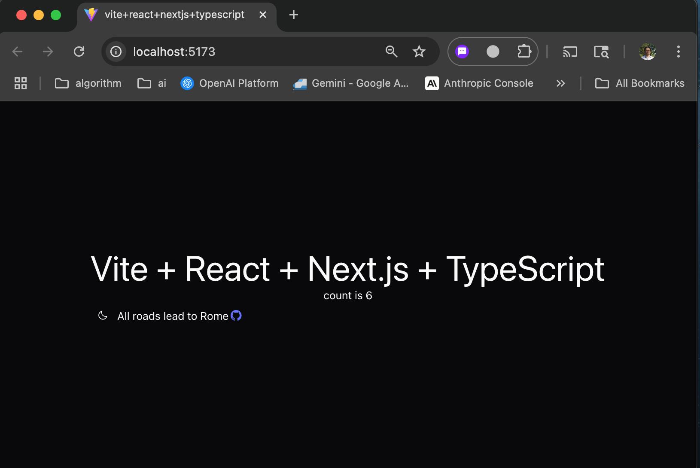

# vite-react-nextjs-template

This template provides a minimal setup to get Vite + React + Next.js + TypeScript working,

## Features

+ Static build
+ Bundled assets
+ Next.js themes
+ Dark/light mode
  
These are required for building extensions for chrome/vscode and benefitting from next.js ui support.

```bash
pnpm install
pnpm format
pnpm lint:fix
pnpm build
pnpm dev
```

